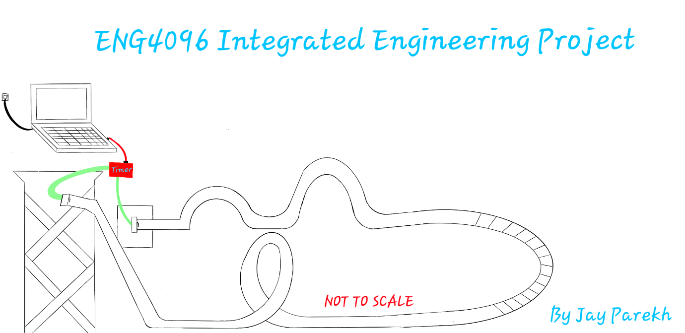
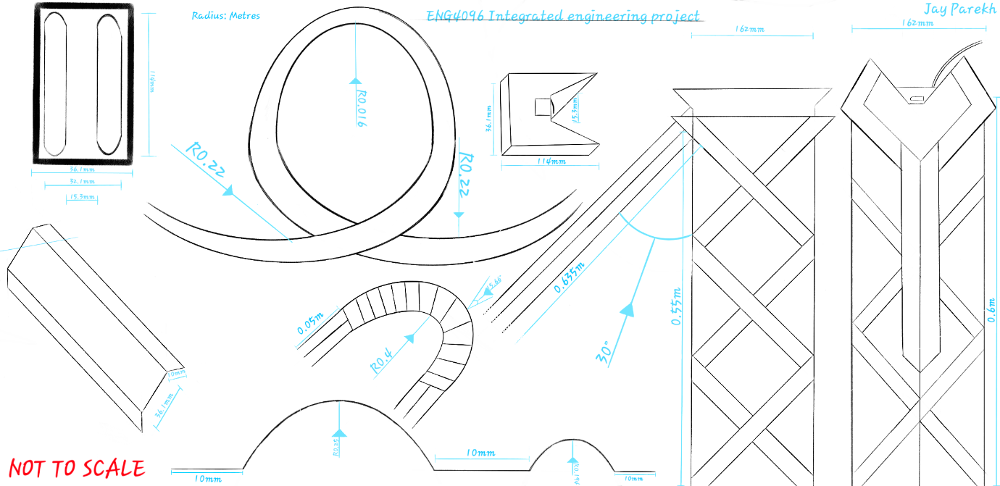
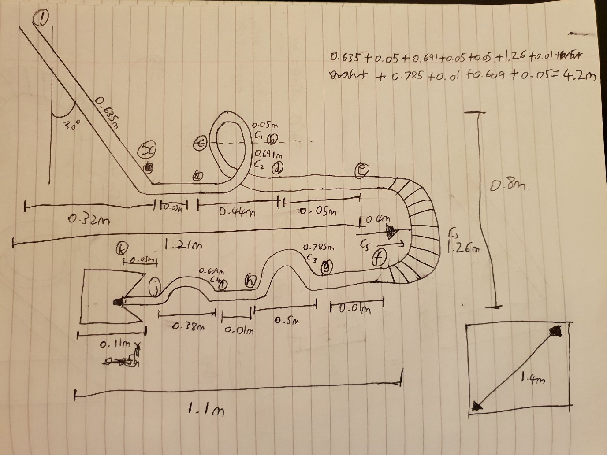

# Marble-Rollercoaster-Engineering
A project designing a marble rollercoaster

# Marble Roller Coaster Project

## Overview
This project involved the design, construction, and testing of a scaled-down roller coaster model for a marble, simulating a full-size roller coaster system. The aim was to explore engineering principles such as gravitational potential energy, momentum conservation, and dynamics, while also practicing sketching, prototyping, and data logging.

The roller coaster integrates various track features—including a loop-the-loop, banked bends, and hills—calculated and constructed to maintain a smooth and stable speed for a marble throughout the ride.

---

## 1. Conceptual Design
The initial concept established the theoretical layout and the data collection points used to analyze performance.

* **Start Tower:** Fitted with a light gate that begins the timer as the marble is released.
* **Calculated Slope:** Designed to give just enough gravitational potential energy for stable speed without excessive acceleration.
* **Loop-the-Loop:** Followed by a banked hairpin turn, designed for continuous motion.
* **Hills:** A taller hill followed by a smaller hill to simulate a realistic ride profile.
* **Data Logging:** A contact stop mechanism at the finish line stops the timer upon marble impact.

---

## 2. Component Detail Drawings
Detailed dimensions were created to ensure each part was accurately fabricated and fit the design parameters.

* **Track Construction:** Built from card and lollipop sticks; the card sags to form a channel for the marble, with 10mm folded edges acting as barriers.
* **Physics Integration:** The loop-the-loop is precisely dimensioned for sufficient centripetal force, and banked bends provide stability during high-speed turning.
* **Energy Conversion:** Hills of varying heights demonstrate energy loss and the conversion between potential and kinetic energy.
* **Safety Features:** Includes a safety catch next to the loop as a contingency structure to stop the marble if it risks derailing.

---

## 3. Final Assembly & Testing
The final layout verified that the model met space constraints and could be tested under controlled conditions.

* **Total Track Length:** 4.2m.
* **System Integration:** All components were integrated into a 1.1m x 0.8m footprint.
* **Testing:** Data was logged via the light gate and stop contact system and reviewed on a computer for performance analysis.

---

## Outcomes
The marble roller coaster successfully demonstrated the intended dynamics and met all design requirements, providing hands-on experience in:
* Prototyping and structural design.
* Application of physics principles (energy, forces, motion).
* Technical sketching and dimensioning.
* Data collection and system integration.

## Project Documentation
* [Download the Full Project Report (Marble Rollercoaster Project.docx)](Marble%20Roller%20Coaster%20Project.docx)
